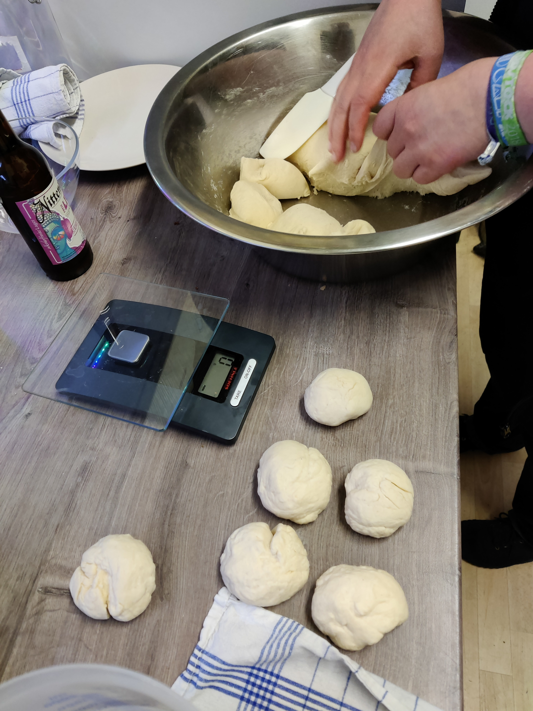
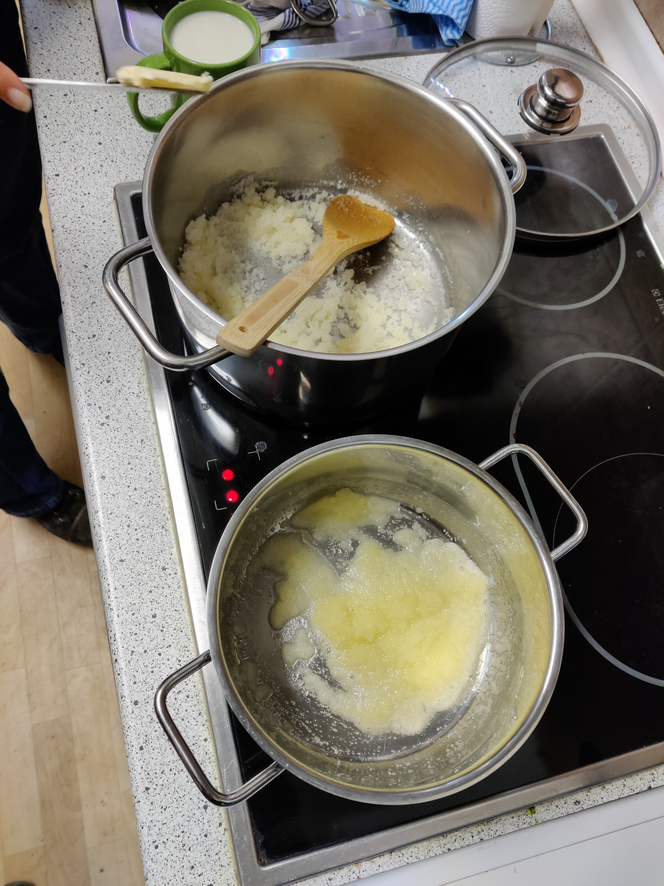
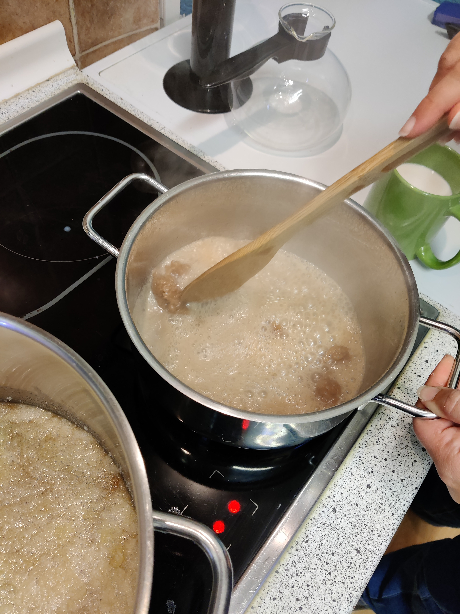
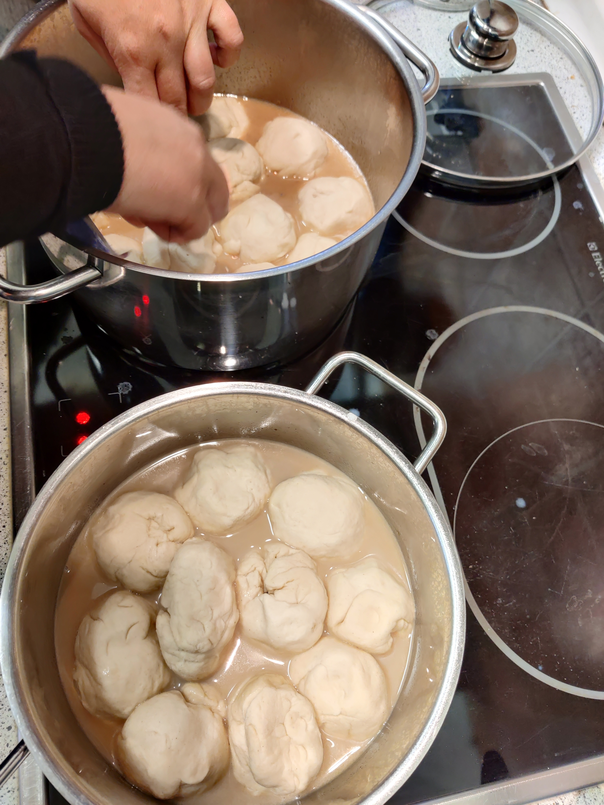
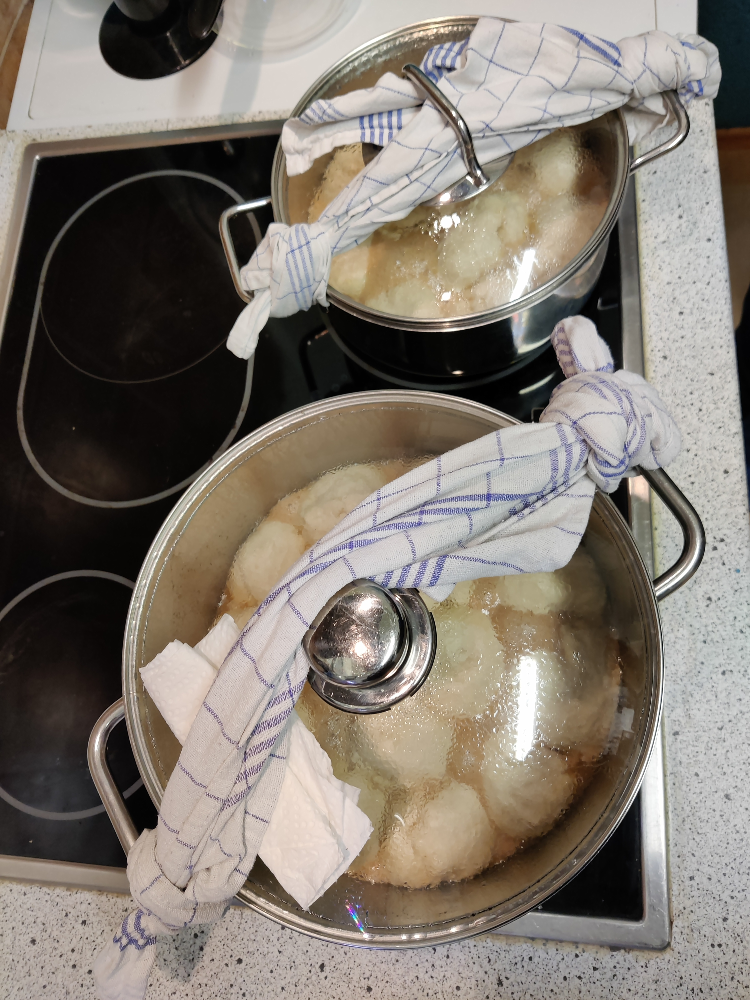
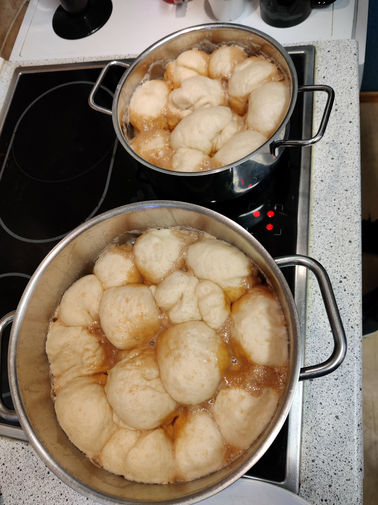

# 24 Dampfnudeln (zB für einen Abend in der Kitchen)

nach einem Rezept von cb

#### Menge
Für 1..24 Personen

## tl;dr
Hefeteig herstellen und in Karamellsose dünsten.

#### Dauer
* Gesamtdauer: 1:30h
  * Arbeitszeit: 0:30h
  * Kochzeit: 0:30h
  * Wartezeit: 0:30h
 

### Werkzeug
Topf mit Glasdeckel [2 Stück]
Herdplatte mit Stufeneinteilung 1..9 [2 Stück]

### Zutaten
#### Nudeln
* Mehl [1kg]
* Milch [0,6l]
* Butter [50g]
* Hefe [1 Würfel]
* Zucker [48g]
* Salz [~1g]

#### Karamell
* Butter [100g]
* Zucker [200g]
* Milch [500ml]

## Anleitung

### Hefeteig
1. Hefeteig mit obigen Zutaten nach allgemeinem Hefeteigrezept (siehe Internet) herstellen.
1. Im Serverraum gehen lassen (Der wärmste Ort ist oben auf dem Serverrack)
1. Zu 24 kleinen Bällen formen. Dazu Teig in drei Teile teilen und dann durch 3x wiederholtes halbieren 24 gleich große Kugeln formen
2. Der Volumenverlusst beim Formen ist hinzunehmen

### Karamell
1. Herd auf Stufe 7..9
1. Butter im Kopf verflüssigen

4. Zucker eingießen, dabei heftig mit dem Schneebesen rühren mit braune Farbe erreicht

6. Milch in der Mikrowelle vorwärmen und langsam hinzugeben. Es zwischt und sprudelt. Dabei heftig rühren. Der Zucker wird zu festen Klumpen werden. Weiter rühren (5min oder mehr) bis er sich wieder aufgelöst hat. Zieltiefe der Karamellsose im Topf 7..10mm

9. Herd auf Stufe 2
10. Nudeln in die Sose setzen, dicht an dicht 

12. Glasdeckel auf den Topf mit einem Geschirrtuch binden, damit andere Anwesende den Deckel nicht öffnen. 

13. 30min ungestört dünsten lassen, ca. 95°, erkennbar daran, dass die Karamellsose leicht blubbert. 
14. Das Garende ist erreicht, wenn die Nudeln nicht weiter wachsen oder gegen den Glasdeckel drücken 

Optische Kontrolle durch den Glasdeckel möglich, öffnen des Deckel während des Garvorgangs stört die Vergrößerung erheblich (verification needed)
